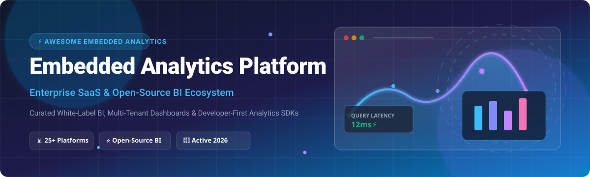

  

# 📊 Awesome Embedded Analytics Platform 🚀

  
  
  
  
  

---

## 💡 Top Embedded Analytics Platforms Ecosystem 🌐

**Curated List of Enterprise SaaS Products & Open-Source GitHub Projects**

*Focused on White-Label Business Intelligence (BI), Customer-Facing Dashboards, Multi-Tenant Analytics & SDK-Based Embedding*

**📅 Last updated: September 2026**

---

## 🔎 Overview & Ecosystem Guide

This repository tracks notable **SaaS platforms** and **open-source projects** for **Embedded Analytics**. These tools help SaaS vendors, product teams, data engineers, and developers embed interactive dashboards, ad-hoc reports, and custom data visualizations directly into web applications—enabling customer-facing analytics without building a proprietary BI platform from scratch.

### 🌟 Why Embedded Analytics Matters
- 📈 **Accelerated Time-to-Market:** Launch white-labeled customer-facing dashboards in days instead of months.
- 🔐 **Multi-Tenancy & Row-Level Security (RLS):** Safely isolate customer data across thousands of tenant organizations.
- 🎨 **Native Customization & Seamless UX:** Blend visualizations into your product via custom SDKs (React, Vue, Angular) or secure iframe tokens.
- 💰 **Monetization Opportunities:** Turn analytics into premium upsell tiers for your SaaS software product.

---

## 📑 Table of Contents
- [🌐 SaaS/Hosted Platforms](#-saashosted-platforms)
- [🔓 Open-Source GitHub Projects](#-open-source-github-projects)
- [🤝 How to Contribute](#-how-to-contribute)
- [☕ Support & Sponsorship](#-support--sponsorship)
- [📈 Star History](#-star-history)
- [⚠️ Disclaimer](#%EF%B8%8F-disclaimer)

---

## 🌐 SaaS/Hosted Platforms

> 💡 **Market Size & Structure:** The global embedded analytics market size is estimated at **$75.5 Billion by 2026** (growing at ~14.8% CAGR). The sector is **moderately fragmented**, balancing cloud-giant ecosystem platforms (Google Cloud Looker) alongside specialized developer-first embedding vendors (Luzmo, Reveal BI, GoodData).

### 🏢 Enterprise SaaS Platform Comparison

Below is a curated breakdown sorted in **descending order by company scale** (estimated annual revenue / parent valuation).

| 🏢 Platform | 💰 Starting Tier Price | 🎁 Free Tier / Trial Limit | 📊 Company Size (Revenue / Valuation) | ⚡ Key Embedding Focus & Features |
| :--- | :--- | :--- | :--- | :--- |
| **[Looker Embedded](https://looker.com/)** | **~$60,000 / year** (Custom quote-based base platform fee) | ⌛ **90-Day Free Trial** (Cloud query consumption fees apply) | 🏦 **Parent Google Cloud: $99.7B+ Revenue (2025)** (Acquired for $2.6B) | 🔹 Iframe & JS Embed SDK, LookML semantic model layer, best for GCP/BigQuery ecosystems. |
| **[Qlik Embedded Analytics](https://www.qlik.com/)** | **~$25,000 / year** (Enterprise capacity licensing) | ⌛ **30-Day Free Trial** (Full Qlik Sense enterprise features) | 💵 **~$750M Revenue** (Private equity owned by Thoma Bravo) | 🔹 Qlik Associative Engine, Nebula.js SDK, mashups, AI Insight Advisor. |
| **[ThoughtSpot Embedded](https://www.thoughtspot.com/)** | **$1,250 / month** (~$15,000/year starting pay-as-you-go) | ⌛ **30-Day Free Trial** (Includes $500 free query credits) | 🚀 **~$150M Revenue / $4.2B Valuation** | 🔹 Search-driven NL-query analytics, interactive drill-downs, React SDK. |
| **[Domo Everywhere](https://www.domo.com/)** | **$300 / month** (~$3,600/year base user tiers) | ⌛ **30-Day Free Trial** (Full platform access for up to 5 users) | 📈 **$317M Revenue (FY2025 Public: NASDAQ DOMO)** | 🔹 Turnkey iframe embedding with server-side token auth and dynamic RLS filtering. |
| **[Sigma Embedded](https://www.sigmacomputing.com/)** | **~$1,000 / year** per creator seat (Enterprise platform commitment) | ⌛ **14-Day Free Trial** (Full access connected to cloud data warehouses) | 🦄 **~$200M ARR / $3.0B Valuation (2026)** | 🔹 Cloud-native spreadsheet-style analytics on Snowflake/BigQuery with embed support. |
| **[Sisense](https://www.sisense.com/)** | **~$21,000 / year** (Standard starting subscription) | ⌛ **30-Day Free Trial** (Full ElastiCube engine and Compose SDK) | 🦄 **~$185M ARR / $1.0B Valuation** | 🔹 ElastiCube in-memory engine, Compose SDK & Sisense.js for iframe-free embedding. |
| **[Logi Analytics (Logi Symphony)](https://www.logianalytics.com/)** | **~$15,000 / year** (Custom OEM platform licensing) | ⌛ **14-Day Free Trial** (Developer evaluation download) | 🏢 **Parent insightsoftware: ~$500M+ Revenue** | 🔹 Dedicated OEM/SaaS embedded analytics with customizable dashboards & self-service reporting. |
| **[GoodData](https://www.gooddata.com/)** | **$1,500 / month** (GoodData Cloud Growth tier) | ⌛ **30-Day Free Trial** (GoodData Cloud Starter instance) | 📊 **~$60M ARR** (Private VC-backed) | 🔹 Developer-first React SDK (GoodData.UI) rendering native DOM components without iframes. |
| **[Luzmo](https://www.luzmo.com/)** | **€495 / month** (~$550/month Starter tier) | ⌛ **10-Day Free Trial** (Unlimited dashboard builds & SDK access) | ⚡ **~$15.6M Funding** ($0–$100M Valuation tier) | 🔹 MAU-based pricing tailored for SaaS applications with flexible embed SDKs & PDF exports. |
| **[Reveal BI](https://www.revealbi.io/)** | **$9,995 / year** (Flat rate per application unlimited users) | ⌛ **30-Day Free Trial** (SDK evaluation for React, Angular, Web Component, .NET) | 🏢 **Parent Infragistics: ~$50M Revenue** | 🔹 Native SDK for Web & Mobile (.NET, Java, JS), tenant-aware REST binding, flat pricing. |
| **[Bold BI](https://www.boldbi.com/)** | **$495 / month** (Embedded Growth Plan) | ⌛ **15-Day Free Trial** (Includes live support setup session) | 🏢 **Parent Syncfusion: ~$30M Revenue** | 🔹 Self-service white-label analytics, multi-tenant architecture, SSO, RLS security. |
| **[Yellowfin BI](https://www.yellowfinbi.com/)** | **~$10,000 / year** (Custom OEM embed license) | ⌛ **30-Day Free Trial** (Full server installer or Docker evaluation) | 🏢 **Parent Idera Inc: ~$200M+ Revenue** | 🔹 Data storytelling, white-label automated signals, multi-tenant governance. |
| **[Metabase Embedded](https://www.metabase.com/)** | **$575 / month** (Embedded Pro tier + $12/user/mo) | ⌛ **14-Day Free Trial** (Metabase Cloud Pro evaluation) | 🚀 **~$16M ARR / $51M Total Funding** | 🔹 Fast setup open-core platform with interactive embedding, custom branding, and RLS. |

---

## 🔓 Open-Source GitHub Projects

> 🆓 **Self-Hosted & Community-Driven:** Open-source embedded analytics tools give engineering teams 100% control over data governance, customization, and source code without per-user SaaS fees or vendor lock-in.

### 🌟 Open-Source Repository Ranking

Listed below sorted in **descending order by GitHub Star Count** ⭐.

| 📦 Repository | ⭐ Star Count Badge | 📜 License | 🛠️ Tech Stack | 🎯 Key Highlights & Embedding Features |
| :--- | :--- | :--- | :--- | :--- |
| **[Grafana](https://github.com/grafana/grafana)** |  | AGPL-3.0 | Go, TypeScript, React | 🔹 Industry standard operational dashboards & telemetry. Embed panels via iframe or JWT auth endpoints. |
| **[Apache Superset](https://github.com/apache/superset)** |  | Apache-2.0 | Python, TypeScript, React | 🔹 Enterprise SQL-first BI platform with dedicated `@superset-ui/embedded-sdk` for web applications. |
| **[Metabase](https://github.com/metabase/metabase)** |  | AGPL-3.0 / Commercial | Clojure, React | 🔹 Ultra-intuitive visual query builder. Community Edition provides simple iframe embedding. |
| **[DataEase](https://github.com/dataease/dataease)** |  | GPL-3.0 | Java, Vue.js | 🔹 Modern open-source BI tool with 500K+ downloads, drag-and-drop charts, SQLBot AI querying, and industry templates. |
| **[Cube.js](https://github.com/cube-js/cube)** |  | Apache-2.0 | Rust, TypeScript | 🔹 Universal semantic layer & headless BI engine for building custom frontend analytics dashboards via REST/GraphQL API. |
| **[Lightdash](https://github.com/lightdash/lightdash)** |  | MIT | TypeScript, React, dbt | 🔹 Open-source Looker alternative natively integrated with dbt models for embedded metrics and analytics. |
| **[Helical Insight](https://github.com/helicalinsight/helicalinsight)** |  | Apache-2.0 | Java 25, React, Python | 🔹 Open-source BI platform featuring BYO-LLM conversational analytics, paginated reporting, RLS, and zero-config Docker. |
| **[Shaper](https://github.com/taleshape/shaper)** |  | MPL-2.0 | TypeScript, DuckDB | 🔹 Lightweight DuckDB-powered SQL dashboards designed for embeddable analytical workflows. |
| **[NexusBI](https://github.com/HeyderHesenov/NexusBI)** |  | MIT | Python (FastAPI), React | 🔹 AI-native natural language BI platform with NL→SQL engines, copilot, white-labeling, and embedded workflows. |
| **[bi-report-kit](https://github.com/bi-report-kit/bi-report-kit)** |  | MIT | TypeScript, React, PostgreSQL | 🔹 Embeddable reporting toolkit for React/Next.js applications with self-contained PostgreSQL storage. |
| **[Embeddable Framework](https://github.com/embeddable)** |  | Open-Core | Web Components, DuckDB-WASM | 🔹 Browser-native embedded analytics running on DuckDB-WASM over Apache Arrow data plane with one-tag embedding. |

---

## 🛠️ Architectural Recommendations

- ⚡ **For React / Next.js Applications:** Consider **bi-report-kit** or **GoodData.UI** for native DOM rendering without iframes.
- 🏢 **For Enterprise Self-Hosted BI:** Deploy **Apache Superset** or **Helical Insight** with Docker Compose and PostgreSQL.
- 🤖 **For AI-Driven Querying (NL-to-SQL):** Integrate **NexusBI** or **DataEase (SQLBot)** alongside local LLM providers (Ollama).
- 🚀 **For High-Performance Edge Analytics:** Leverage **Shaper** or **Embeddable Framework** powered by DuckDB-WASM.

---

## 🤝 How to Contribute

Contributions are welcome! Please follow these simple guidelines:

1. 🍴 **Fork** this repository.
2. 📝 **Add/Update** entries in `README.md` following the tabular format.
3. 🔎 **Provide Factual Info:** Include name, official site, 1–2 sentence description, exact pricing, and open-source star badges.
4. 📬 **Submit a Pull Request** with a clear title and description.

If you find this list helpful, please **Star ⭐ this repository** to support the project!

---

## ☕ Support & Sponsorship

If this project has saved you hours of research or helped you select the right embedded analytics platform for your SaaS, please consider supporting the project!

- 🌟 **Star this repository** to improve its visibility.
- 🔀 **Fork & Share** it with developers, product managers, and data engineers.
- ☕ **Buy me a coffee / Sponsor:** Support ongoing maintenance via [GitHub Sponsors](https://github.com/sponsors/ishandutta2007).

  

---

## 📈 Star History

---

## ⚠️ Disclaimer

- This list is **community-curated** for informational purposes and does not constitute an endorsement.
- Embedded analytics systems process enterprise and customer data; ensure compliance with GDPR, HIPAA, and SOC2 regulations.
- Licensing and SaaS pricing change periodically; always verify exact terms with platform vendors.

---

  <b>Made with ❤️ for SaaS Product Teams, Data Engineers & Platform Architects.</b>

